# Wellness Tourism MLOps

An end-to-end machine learning system that predicts whether a customer will
purchase a wellness tourism package. The project turns raw customer data into
a reproducible training workflow and, ultimately, an interactive prediction
application.

> **Current scope:** data preparation, dataset versioning, model training,
> tuning, evaluation, and local MLflow experiment tracking are implemented.
> Model publication and the Streamlit application are the next delivery stages.

## Architecture at a Glance

```mermaid
flowchart LR
	A["1. Raw customer data<br/>CSV"] --> B["2. Prepare data<br/>Clean, explore, split"]
	B --> C["3. Version data<br/>Hugging Face Dataset"]
	C --> D["4. Train and tune<br/>sklearn Pipeline"]
	D --> E["5. Track experiments<br/>MLflow"]
	E --> F["6. Publish model<br/>Hugging Face Hub"]
	F --> G["7. Serve predictions<br/>Streamlit"]

	classDef done fill:#e7f7ef,stroke:#159570,color:#102a25;
	classDef active fill:#fff4d6,stroke:#e5a000,color:#332500;
	classDef planned fill:#eef3f8,stroke:#7290ad,color:#23384d,stroke-dasharray: 5 5;
	class A,B,C,D,E done;
	class F active;
	class G planned;
```



The central design principle is **artifact continuity**: each stage produces a
versioned or traceable output that becomes the next stage's input. This keeps
training and inference aligned and makes results easier to reproduce.

## The Seven Stages

| Stage | Responsibility | Input | Output | Status |
|---|---|---|---|---|
| 1. Data source | Supply customer and purchase behavior data | Raw source records | `tourism.csv` | Available |
| 2. Data preparation | Inspect, clean, and split the data | Raw CSV | `train.csv`, `test.csv` | Implemented |
| 3. Data versioning | Store reproducible processed datasets | Train/test CSV files | Hugging Face dataset revision | Implemented |
| 4. Training | Preprocess, train, tune, and evaluate models | Versioned dataset | Fitted sklearn pipeline | Implemented |
| 5. Experiment tracking | Record parameters, metrics, and artifacts | Training runs | MLflow experiment history | Implemented locally |
| 6. Model deployment | Publish the selected pipeline and model card | Best MLflow artifact | Versioned Hugging Face model | Planned |
| 7. Web application | Collect customer details and return a prediction | Published model | Purchase probability and class | Planned |

### 1. Data Source

The source is the
[Wellness Tourism Dataset](https://huggingface.co/datasets/motidev/wellness-tourism-dataset),
a CSV dataset containing customer characteristics and package-purchase
behavior. The prediction target is `ProdTaken`:

- `1`: the customer purchased the package.
- `0`: the customer did not purchase the package.

Keeping the raw source separate from generated data preserves a stable starting
point for future experiments.

### 2. Data Preparation

[notebooks/01_data_preparation.ipynb](notebooks/01_data_preparation.ipynb)
owns the preparation workflow:

1. Load the raw CSV from the Hugging Face Hub.
2. Inspect shape, columns, data types, missing values, duplicates, and target balance.
3. Remove `Unnamed: 0` and the non-predictive `CustomerID` identifier.
4. Separate predictors from `ProdTaken`.
5. Create a stratified 80/20 train/test split with `random_state=42`.
6. Save the resulting datasets under `data/`.

Stratification preserves the target-class proportions in both splits, which is
especially important when evaluating an imbalanced classification problem.

### 3. Data Versioning

The preparation notebook uploads the processed files to the Hugging Face
dataset repository using this contract:

```text
processed/
├── train.csv
└── test.csv
```

Training reads these files directly from the Hub. As a result, a model run does
not depend on an undocumented local preprocessing state. Hugging Face repository
history also provides a record of dataset changes over time.

### 4. Model Training and Evaluation

[notebooks/02_model_experimentation.ipynb](notebooks/02_model_experimentation.ipynb)
loads the processed splits and builds one sklearn `Pipeline` containing both
preprocessing and classification:

- **Numeric features:** median-value imputation.
- **Categorical features:** most-frequent imputation followed by one-hot encoding.
- **Estimator:** `DecisionTreeClassifier` with a fixed random seed.
- **Tuning:** five-fold `GridSearchCV`, optimized for F1 score.
- **Evaluation:** accuracy, precision, recall, F1, ROC-AUC, and a classification report.

Bundling preprocessing with the estimator prevents training-serving skew: the
same transformations used during fitting can travel with the selected model.

### 5. Experiment Tracking

MLflow records two comparable runs in the
`wellness-tourism-experiments` experiment:

- `DecisionTree_Baseline`
- `DecisionTree_Tuned`

Each run captures model parameters, evaluation metrics, and the complete fitted
pipeline. Local metadata is stored in `mlflow.db`; model artifacts are ignored
by Git and remain in the local MLflow artifact store.

From the repository root, open the tracking UI with:

```bash
.venv/bin/mlflow ui --backend-store-uri sqlite:///mlflow.db
```

Then visit <http://127.0.0.1:5000> and compare runs using F1 and ROC-AUC alongside
precision and recall. Accuracy alone can hide poor minority-class performance.

### 6. Model Deployment

The deployment stage will promote the best complete pipeline, not only the
classifier, to a Hugging Face model repository. A release should include:

- The serialized preprocessing and prediction pipeline.
- A model card describing intended use, inputs, metrics, and limitations.
- A version or revision that the application can pin.
- A small inference example and the expected feature schema.

Promotion should be deliberate: only a run that satisfies the agreed evaluation
thresholds should move from MLflow to the model repository.

### 7. Streamlit Application

The final application will collect customer information, load the pinned model
revision, and return both a purchase decision and its probability. The intended
request path is:

```text
Customer inputs → schema validation → pipeline.predict_proba()
				→ prediction + probability + interpretation
```

The app should reject incomplete or invalid fields clearly and must use the
published pipeline so that preprocessing remains identical to training.

## Repository Map

```text
wellness_tourism_mlops/
├── data/
│   ├── train.csv                 # Local processed training split
│   └── test.csv                  # Local processed test split
├── notebooks/
│   ├── 01_data_preparation.ipynb
│   └── 02_model_experimentation.ipynb
├── apps/                         # Streamlit application (planned)
├── src/                          # Reusable training/inference code (planned)
├── tests/                        # Automated checks (planned)
└── README.md
```

## Run the Implemented Workflow

### Prerequisites

- Python 3.10 or newer
- A Hugging Face account and write token for dataset uploads

### Local setup

```bash
python3 -m venv .venv
source .venv/bin/activate
pip install pandas datasets huggingface_hub scikit-learn mlflow skops jupyter
```

Authenticate before running upload cells in the preparation notebook:

```bash
huggingface-cli login
```

Run the notebooks in order:

1. `01_data_preparation.ipynb` creates and publishes the processed splits.
2. `02_model_experimentation.ipynb` trains, evaluates, tunes, and logs models.

Notebook paths are relative to the `notebooks/` directory. Run them from their
existing location so local data and MLflow paths resolve as documented.

## Reproducibility Contract

A result is reproducible when these four references are known:

| Reference | What it identifies |
|---|---|
| Git commit | Preparation and training code |
| Hugging Face dataset revision | Exact training and test data |
| MLflow run ID | Parameters, metrics, and fitted artifact |
| Hugging Face model revision | Exact model used for inference |

Together, these references create a traceable route from a prediction back to
the model run, training data, and code that produced it.

## Delivery Roadmap

- [x] Explore and clean the raw dataset.
- [x] Produce a reproducible stratified train/test split.
- [x] Publish processed data to Hugging Face.
- [x] Build a reusable preprocessing and model pipeline.
- [x] Compare baseline and tuned runs with MLflow.
- [ ] Define model promotion criteria and publish the selected model.
- [ ] Add a model card and versioned inference schema.
- [ ] Build the Streamlit prediction interface.
- [ ] Add automated data, training, and inference tests.

## Outcome

This architecture turns a one-off notebook experiment into a traceable ML
product: data is versioned, transformations travel with the model, experiments
remain comparable, and deployment has a clear path from approved run to
end-user prediction.