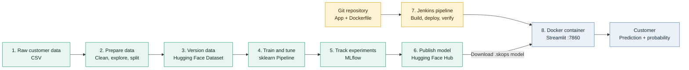
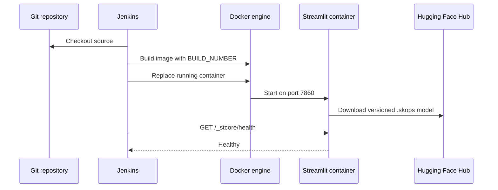

# Wellness Tourism MLOps

An end-to-end machine learning system that predicts whether a customer will
purchase a wellness tourism package. The project turns raw customer data into
a reproducible training workflow and, ultimately, an interactive prediction
application.

> **Current scope:** the complete path from data preparation to a containerized
> Streamlit application is implemented. Hugging Face stores the versioned data
> and model artifact; Jenkins builds, deploys, and verifies the application
> container without relying on paid Hugging Face Docker hosting.

## Architecture at a Glance



The central design principle is **artifact continuity**: each stage produces a
versioned or traceable output that becomes the next stage's input. This keeps
training and inference aligned and makes results easier to reproduce.

## The Eight Stages

| Stage | Responsibility | Input | Output | Status |
|---|---|---|---|---|
| 1. Data source | Supply customer and purchase behavior data | Raw source records | `tourism.csv` | Available |
| 2. Data preparation | Inspect, clean, and split the data | Raw CSV | `train.csv`, `test.csv` | Implemented |
| 3. Data versioning | Store reproducible processed datasets | Train/test CSV files | Hugging Face dataset revision | Implemented |
| 4. Training | Preprocess, train, tune, and evaluate models | Versioned dataset | Fitted sklearn pipeline | Implemented |
| 5. Experiment tracking | Record parameters, metrics, and artifacts | Training runs | MLflow experiment history | Implemented locally |
| 6. Model registry | Publish the selected pipeline | Best evaluated pipeline | Versioned Hugging Face model | Implemented |
| 7. Delivery automation | Build, replace, and health-check the service | Git repository | Verified Docker container | Implemented with Jenkins |
| 8. Web application | Collect customer details and return a prediction | Published model | Purchase probability and class | Implemented with Streamlit |

### 1. Data Source

The source is the
[Wellness Tourism Dataset](https://huggingface.co/datasets/motidev/wellness-tourism-dataset),
a CSV dataset containing customer characteristics and package-purchase
behavior. The prediction target is `ProdTaken`:

- `1`: the customer purchased the package.
- `0`: the customer did not purchase the package.

Keeping the raw source separate from generated data preserves a stable starting
point for future experiments.

### 2. Data Preparation

[notebooks/01_data_preparation.ipynb](notebooks/01_data_preparation.ipynb)
owns the preparation workflow:

1. Load the raw CSV from the Hugging Face Hub.
2. Inspect shape, columns, data types, missing values, duplicates, and target balance.
3. Remove `Unnamed: 0` and the non-predictive `CustomerID` identifier.
4. Separate predictors from `ProdTaken`.
5. Create a stratified 80/20 train/test split with `random_state=42`.
6. Save the resulting datasets under `data/`.

Stratification preserves the target-class proportions in both splits, which is
especially important when evaluating an imbalanced classification problem.

### 3. Data Versioning

The preparation notebook uploads the processed files to the Hugging Face
dataset repository using this contract:

```text
processed/
├── train.csv
└── test.csv
```

Training reads these files directly from the Hub. As a result, a model run does
not depend on an undocumented local preprocessing state. Hugging Face repository
history also provides a record of dataset changes over time.

### 4. Model Training and Evaluation

[notebooks/02_model_experimentation.ipynb](notebooks/02_model_experimentation.ipynb)
loads the processed splits and builds one sklearn `Pipeline` containing both
preprocessing and classification:

- **Numeric features:** median-value imputation.
- **Categorical features:** most-frequent imputation followed by one-hot encoding.
- **Estimator:** `DecisionTreeClassifier` with a fixed random seed.
- **Tuning:** five-fold `GridSearchCV`, optimized for F1 score.
- **Evaluation:** accuracy, precision, recall, F1, ROC-AUC, and a classification report.

Bundling preprocessing with the estimator prevents training-serving skew: the
same transformations used during fitting can travel with the selected model.

### 5. Experiment Tracking

MLflow records two comparable runs in the
`wellness-tourism-experiments` experiment:

- `DecisionTree_Baseline`
- `DecisionTree_Tuned`

Each run captures model parameters, evaluation metrics, and the complete fitted
pipeline. Local metadata is stored in `mlflow.db`; model artifacts are ignored
by Git and remain in the local MLflow artifact store.

From the repository root, open the tracking UI with:

```bash
.venv/bin/mlflow ui --backend-store-uri sqlite:///mlflow.db
```

Then visit <http://127.0.0.1:5000> and compare runs using F1 and ROC-AUC alongside
precision and recall. Accuracy alone can hide poor minority-class performance.

### 6. Model Registry

The selected complete pipeline, not only the classifier, is serialized in the
safer `skops` format and uploaded to the
[Hugging Face model repository](https://huggingface.co/motidev/wellness-tourism-model).
The Streamlit application downloads `wellness_tourism_model.skops` from this
repository when its cached model loader initializes.

A production model release should include:

- The serialized preprocessing and prediction pipeline.
- A model card describing intended use, inputs, metrics, and limitations.
- A version or revision that the application can pin.
- A small inference example and the expected feature schema.

Hugging Face is used here as a versioned **model registry and artifact source**.
It does not run the Docker container. Promotion should remain deliberate: only
a run that satisfies agreed evaluation thresholds should move from MLflow to
the model repository.

### 7. Jenkins Delivery Pipeline

[Jenkinsfile](Jenkinsfile) automates application delivery on a Jenkins agent
with Docker access:

1. Check out the repository from source control.
2. Build `wellness-tourism-app:${BUILD_NUMBER}` from the [Dockerfile](Dockerfile).
3. Stop and remove the previous `wellness-tourism-app` container if it exists.
4. Start the new container with `--restart unless-stopped` and publish port `7860`.
5. Call `/_stcore/health`; fail the build if Streamlit is not healthy.



This replaces paid Docker hosting on Hugging Face. Jenkins controls deployment
on the configured host, while Hugging Face continues to serve the model artifact.

### 8. Streamlit Application

The application in [app/app.py](app/app.py) collects customer information,
loads the published model, and returns both a purchase decision and its
probability. The request path is:

```text
Customer inputs → schema validation → pipeline.predict_proba()
				→ prediction + probability + interpretation
```

The published pipeline performs the same preprocessing used during training,
preventing training-serving skew. Streamlit constrains required inputs through
typed numeric fields and predefined categorical options.

## Repository Map

```text
wellness_tourism_mlops/
├── app/
│   └── app.py                    # Streamlit prediction interface
├── data/
│   ├── train.csv                 # Local processed training split
│   └── test.csv                  # Local processed test split
├── model/                        # Local serialized model artifacts
├── notebooks/
│   ├── 01_data_preparation.ipynb
│   └── 02_model_experimentation.ipynb
├── Dockerfile                    # Streamlit runtime image
├── Jenkinsfile                   # Build, deploy, and health-check pipeline
├── requirements.txt              # Pinned Python dependencies
├── src/                          # Reusable training/inference code (planned)
├── tests/                        # Automated checks (planned)
└── README.md
```

## Run the Implemented Workflow

### Prerequisites

- Python 3.10 or newer
- A Hugging Face account and write token for dataset uploads
- Docker for containerized application deployment
- Jenkins with access to the Docker daemon for automated deployment

### Local setup

```bash
python3 -m venv .venv
source .venv/bin/activate
pip install pandas datasets huggingface_hub scikit-learn mlflow skops jupyter
```

Authenticate before running upload cells in the preparation notebook:

```bash
huggingface-cli login
```

Run the notebooks in order:

1. `01_data_preparation.ipynb` creates and publishes the processed splits.
2. `02_model_experimentation.ipynb` trains, evaluates, tunes, and logs models.

Notebook paths are relative to the `notebooks/` directory. Run them from their
existing location so local data and MLflow paths resolve as documented.

### Run the application locally

```bash
streamlit run app/app.py
```

### Run the application with Docker

```bash
docker build -t wellness-tourism-app:local .
docker run --rm -p 7860:7860 wellness-tourism-app:local
```

Open <http://localhost:7860>. The container downloads the published model from
Hugging Face when the application starts.

### Deploy with Jenkins

Create a Jenkins Pipeline job that uses this repository's `Jenkinsfile`. The
agent must have Git, Docker, and network access to Hugging Face. Each successful
build replaces the existing application container and verifies its health on
port `7860`.

## Reproducibility Contract

A result is reproducible when these four references are known:

| Reference | What it identifies |
|---|---|
| Git commit | Preparation and training code |
| Hugging Face dataset revision | Exact training and test data |
| MLflow run ID | Parameters, metrics, and fitted artifact |
| Hugging Face model revision | Exact model used for inference |
| Jenkins build number | Docker image and deployment execution |

Together, these references create a traceable route from a prediction back to
the model run, training data, and code that produced it.

## Delivery Roadmap

- [x] Explore and clean the raw dataset.
- [x] Produce a reproducible stratified train/test split.
- [x] Publish processed data to Hugging Face.
- [x] Build a reusable preprocessing and model pipeline.
- [x] Compare baseline and tuned runs with MLflow.
- [x] Publish the selected pipeline to Hugging Face.
- [x] Build the Streamlit prediction interface.
- [x] Package the application with Docker.
- [x] Automate deployment and health verification with Jenkins.
- [ ] Define explicit model promotion criteria.
- [ ] Add a model card and versioned inference schema.
- [ ] Add automated data, training, and inference tests.

## Outcome

This architecture turns a one-off notebook experiment into a traceable ML
product: data is versioned, transformations travel with the model, experiments
remain comparable, and Jenkins provides a repeatable route from repository
change to a verified Streamlit container. Hugging Face remains the source of
versioned model truth without being responsible for paid application hosting.